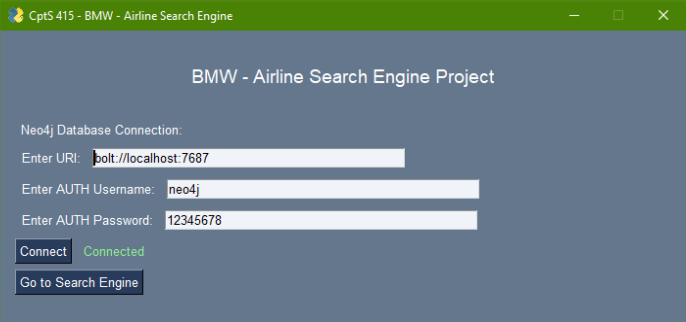
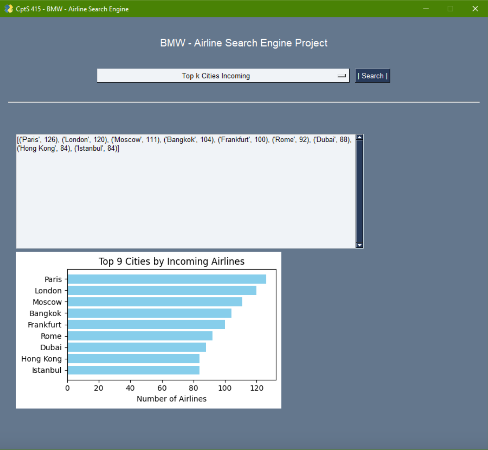

# Airline Search Engine

## Overview

The Airline Search Engine is a robust tool developed to streamline the process of navigating through the complex network of global airline data. This project utilizes a graph-based approach to handle vast amounts of airline, airport, and route information effectively. By leveraging technologies such as Neo4j, PySpark, and PySimpleGUI, this search engine offers users a powerful platform for exploring aviation data.

The program provides functionalities such as searching for airports and airlines, listing code-sharing flights, and identifying active airlines within the United States. It also features advanced search options like trip recommendations with constraints on the number of stops and finding the shortest path between two cities.

### Key Features

- **Advanced Search Capabilities:** Users can search for specific airlines, airports, and routes, and also discover trips between two cities with the fewest stops or within a certain number of hops from a starting city.
- **Graph Database Utilization:** Utilizing Neo4j, the project benefits from a graph database structure to efficiently query and visualize complex relationships between different aviation entities.
- **Interactive User Interface:** The GUI, built with PySimpleGUI, provides a user-friendly environment that simplifies interaction with the search engine.
- **Data-Driven Insights:** From identifying the city with the highest number of airports to analyzing trip paths, the engine is equipped to provide valuable insights into the aviation industry.

## Architecture

This project is built on the openflights.org dataset, which includes comprehensive details on airlines, airports, routes, and more. The system architecture uses a graph database model to represent the intricate relationships within the dataset, facilitating quick and intuitive data retrieval.

# Team

- [Mitchell Kolb](https://github.com/mitchellkolb)
- [Noah Waxman](https://github.com/noah-waxman)
- Brian Joo

--- 
# Acknowledgments
This codebase and all supporting materials was made as apart of a course for my undergrad at WSU for CPTS 415 - Big Data in the Fall of 2023. 